# SILK를 통한 통제 어휘(controlled vocabularies) 할당하기

> **This tutorial explains how [SILK](http://silk.wbsg.de/) can be used to discover links between concepts in controlled vocabularies. By way of example, we have used SILK to create a mapping between the [Named Autority Lists](http://publications.europa.eu/mdr/authority/country/index.html)(NALs) of the [Publications Office of the EU](http://publications.europa.eu/) and the MARC list of the [US Library of Congress](http://loc.gov/).**

## Introduction

[SILK Workbench](https://www.assembla.com/spaces/silk/wiki/Silk_Workbench)는 통제 어휘의 링크 탐색(link discovery)을 위한 오픈 소스 소프트웨어 솔루션이다. 이는 [SKOS](http://www.w3.org/TR/skos-reference/) RDF 파일로 표현된 통제 어휘 집합을 분석해주고 자동으로 이 어휘의 개념들 간의 링크를 탐색할 수 있다. [Click here to download the SILK Workbench](http://silk.wbsg.de/releases/silk_2.6.0.zip).

이 tutorial에서는 다음의 통제 어휘들 간의 mapping을 생성하기 위해 [SILK](http://silk.wbsg.de/)를 사용할 것이다. 통제 어휘들은 다음과 같다:

- **The [Countries Named Authority List](http://publications.europa.eu/mdr/authority/country/index.html) of the [Publication Officce of the EU](http://publications.europa.eu/):** Common Authority Tables(CATs) 라고도 알려져 있는 NAL의 통제 어휘 또는 값 리스트는 유럽 연합의 협회 간의 정보 교환을 촉진하기 위해 사용되는 harmonised code와 multilingual label들의 모음이다. NAL들은 다른 형식들로 사용할 수 있으며 그 중 [RDF/XML](http://www.w3.org/TR/rdf-syntax-grammar/)의 [SKOS](http://www.w3.org/TR/skos-reference/) data로 사용할 수 있다.

- **The [MARC Countries list](http://id.loc.gov/vocabulary/countries.html) of the [US Library of Congress](http://loc.gov/):** 미국 의회도서관(Library of Congress)은 정보 자원의 설명 및 색인을 위한 통제 어휘와 권한의 접근, 다운로드를 사용자로 하여금 유용하게 해주는 liked data service들을 제공한다.

위의 통제 어휘는 국가 확인을 위해 URIs를 사용한다. 예를 들어, 밑의 룩셈부르크의 URIs를 보자:

- Metadata

  Registry: [http://publications.europa.eu/resource/authority/country/LUX](http://publications.europa.eu/resource/authority/country/LUX)

- Library of Congress: [http://id.loc.gov/vocabulary/countries/lu.html](http://id.loc.gov/vocabulary/countries/lu.html)

[SILK](http://silk.wbsg.de/)는 [SKOS](http://www.w3.org/TR/skos-reference/) 언어를 이용해 NAL들 간의 mapping들은 보여준다. 위의 룩셈부르크의 URIs의 경우, 이는 [N-Triples](http://www.w3.org/TR/n-triples/)로 표현된다.

두 list들을 mapping하기 위해서는 아래의 input file들이 사용된다:

**Metadata Registry:**

- File: [countries-skos.rdf](http://publications.europa.eu/mdr/resource/authority/country/skos/countries-skos.rdf)
- Format: [SKOS](http://www.w3.org/TR/skos-reference/)
- URI: [http://publications.europa.eu/mdr/resource/authority/country/skos/countries-skos.rdf](http://publications.europa.eu/mdr/resource/authority/country/skos/countries-skos.rdf)
- Number of records: 308

**Library of Congress:**

- File: [countries.rdf](http://id.loc.gov/vocabulary/countries.rdf)
- Format: [MADS](http://www.loc.gov/standards/mads/) and [SKOS](http://www.w3.org/TR/skos-reference/)
- URI: [http://id.loc.gov/vocabulary/countries.rdf](http://id.loc.gov/vocabulary/countries.rdf)
- Number of record: 333

## 1. 프로젝트 생성 및 설정

새로운 프로젝트를 생성하기 위한 첫 발걸음은 **Workspace** 탭에 있다. 이 탭에서 사용자에 의해 관리되는 모든 프로젝트들이 나열된다.

프로젝트는 아래의 항목들을 포함해야 한다:

- URI prefixes which are used in the project;
- list of data sources;
- at least a linking task;
- an output;

프로젝트를 생성하기 위해 **Project** 버튼을 누르고 프로젝트 이름을 입력한다.

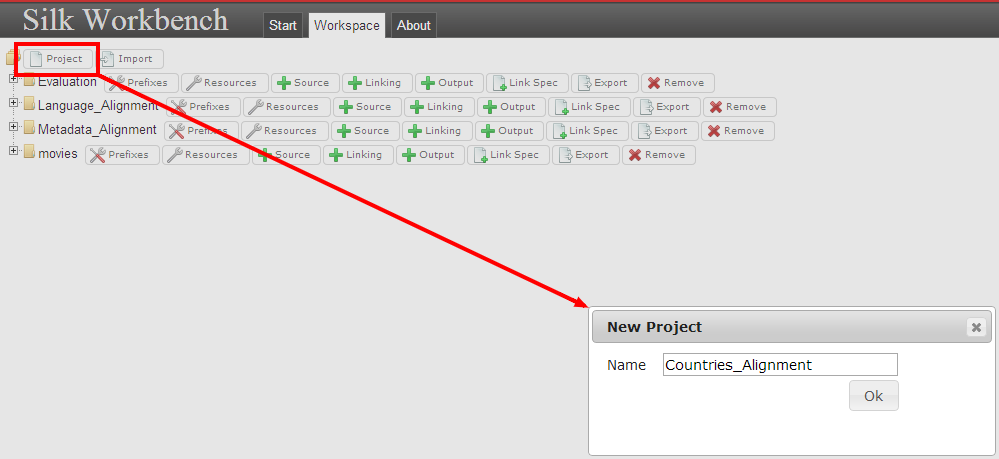

일단 프로젝트가 생성되면, input file들의 namespace들을 작성한다. 이를 수정하기 위해서는 Countries_alignment 프로젝트의 **Prefixes** 버튼을 누르고 목록을 작성한다.

 

## 2. SKOS을 이용한 통제 어휘 가져오기

[SILK](http://silk.wbsg.de/)에서는 source dataset들을 정의하기 위해 파일들이 resource로써 system에 업로드되어야 한다. mapping을 위해 사용될 이 두 파일들을 업로드하기 위해서 **Resources** 버튼을 누른 뒤 두 파일의 **Upload resource** 부분을 모두 입력해야 한다.

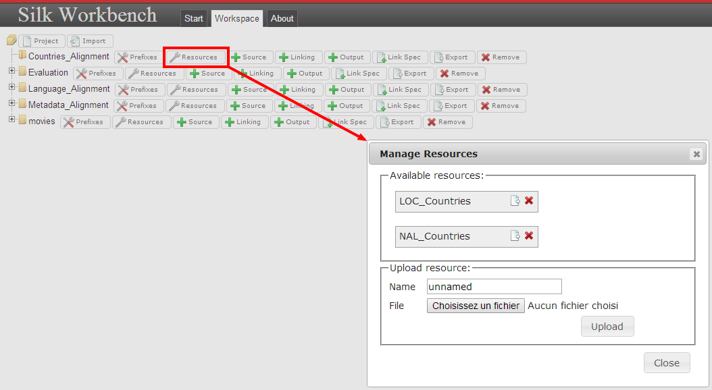

일단 파일들이 resource로써 정의되고 tools에 업로드되면, mapping을 위해 사용될 data sources들을 작성한다. **Source** 버튼을 누르고 **RDF dump** 탭(LOC_Countries and NAL_Countries previously uploaded as **Resources**)의 resource를 선택한다.

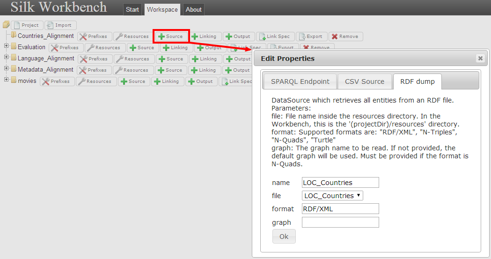

[SILK](http://silk.wbsg.de/)는 또한 [SPARQL](http://www.w3.org/TR/rdf-sparql-query/) Endpoint와 [CSV](http://tools.ietf.org/html/rfc4180) Source를 사용할 수 있다.

## 3. Alignment 설정하기

alignment 과정을 준비하기 위해 프로젝트의 연결 과정을 얻고 source와 target을 선택하기 위해 **Task** 버튼을 클릭한다. 이 연결 과정은 링크을 생성하기 위한 [SILK](http://silk.wbsg.de/) engine에 의해 실행될 수 있는 동작을 가능하게 한다.

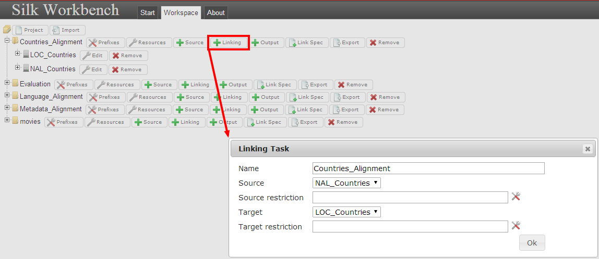

이 과정에서, 프로젝트는 다음의 항목을 포함해야 한다:

- the resources;
- the data sources;
- the linking task

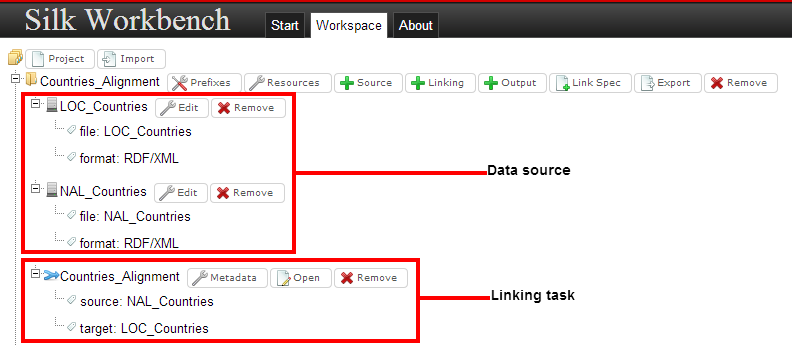

Alignment를 생성하기 위해 linking task 항목의 **Open** 버튼을 클릭하면 **Editor**가 화면에 표시될 것이다. 이는 linkage rule editor interface이다. 이 인터페이스는 사용자가 가시적인 방법으로 rule을 수정하는것을 가능하게 한다.

이 editor는 두 부분으로 나누어진다:

- 왼쪽 부분은 4가지의 구성 요소를 포함한다:
  -  The **path input** component with the source and **target path** fields.
  - And the [SILK](http://silk.wbsg.de/) function components which enable to manipulate the data source: **Transformations**, **Comparators** and **Aggregators**. For each of them a set of functions are available, for instance **Alpha reduce**, **Equality**, etc.
- 오른쪽 부분은 **editor interface** 부분이다. 이는 사용자가 [SILK](http://silk.wbsg.de/) 구성 요소 부분에서 drag and drop을 통해 path fields나 function들을 사용하게 해 준다.

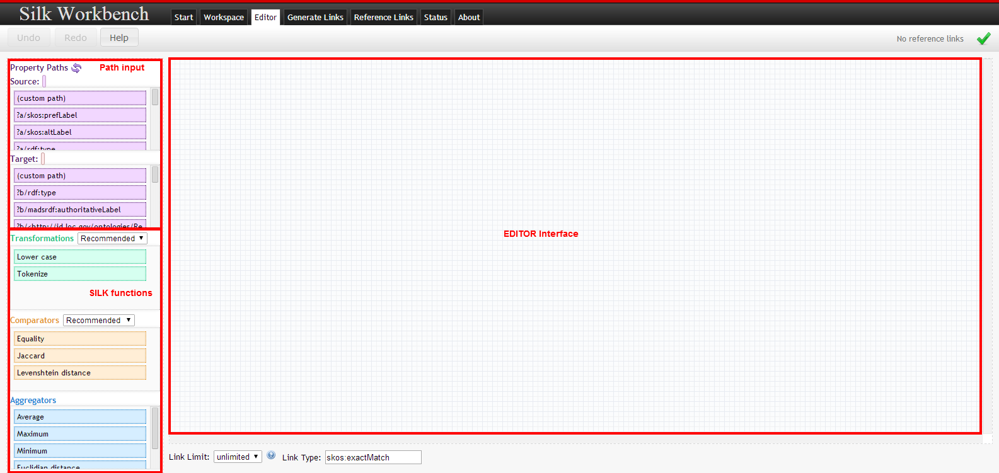

이 tutorial에서는 아래의 것들이 두 어휘들을 연결하기 위한 path이다:

- Library of Congress - [madsrdf:authoritativeLabel](http://www.loc.gov/standards/mads/rdf/v1.html#authoritativeLabel): contains the english country name <madsrdf:authoritativeLabel 
- Metadata Registry - [skos:prefLabel](http://www.w3.org/2009/08/skos-reference/skos.html#prefLabel): contains also the country name in several language <skos:prefLabel xml:lang="bg">Бруней</skos:prefLabel>

Named Authority List Countries가 다양한 언어로 국가의 이름을 번역했기 때문에 두 번째 path인 skos:prefLabel은 오직 영어 version의 국가 이름만을 얻기 위해 언어 특성인 xml:lang을 통해 제한된다. 그러므로 target source Named Authoruty List를 위한 path는 다음과 같다:

**skos:prefLabel[@lang='en']**

그 다음 뒤의 방법의 동작을 정의해야 한다. 이는 removing space와 empty values에 의한 path들을 포함하고 있는 string의 transforming을 통해 시작될 것이다. 그리고 각각의 string은 대문자로 변환될 것이다. 이 규칙은 이 종류의 data의 string들을 비교하기에 충분해야 한다. 마지막으로 동등 비교 함수(function equality)를 통해 string들이 비교될 것이다.

그러므로 이 mapping을 위해, 다음의 항목들을 사용한다:

- Path (Path component)
- Remove blanks (Transformation component)
- Remove empty values (Transformation component)
- Upper Case (Transformation component)
- Equality (Comparator component)

일단 모든 항목들을 drag and drop을 통해 연결하면 결과는 다음 그림과 같을 것이다.

이제 자동으로 link를 탐색하기 위한 준비가 되었다.

## 4. 자동으로 link 탐색하기

일단 앞선 작업이 수행된다면, **Start** 버튼과 **Generate Links** 버튼을 클릭함으로써 실행하기 위해 Generate Links 탭을 클릭한다. 

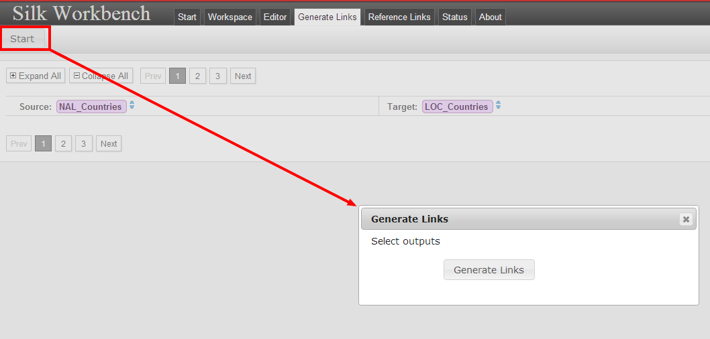

일단 링크가 발견되면, 사용자 인터페이스는 새로고침된 후 웹 어플리케이션이 그 작업이 표시되는 곳에서 고안된 일련의 단계들의 자세한 요약이 있는 링크를 자세히 파고들기 위해 제공한다.

더욱이 각각의 링크에서, 신뢰도에 관한 점수는 결과물에서 사용자가 정보를 얻을수 있는가에 관한 것이다.

이 화면에서 그 링크가 정확한지 혹은 아닌지 확인한다. [SILK](http://silk.wbsg.de/)는 그 링크에 대한 상태를 제공한다. 사용자는 3가지의 상태 중 선택할 수 있다:

-  링크가 정확하다고 확인하고 확정할 수 있는 것, 링크는 positive reference 링크 모음에 포함될 것이다.
-  링크가 결정되지 않음을 확인하는 것, 링크극 reference 링크 모음에 포함되지 않을 것이다.
-  링크가 정확하지 않다고 확인하고 확정할 수 있는 것, 링크는 negative reference 링크 모음에 포함될 것이다.

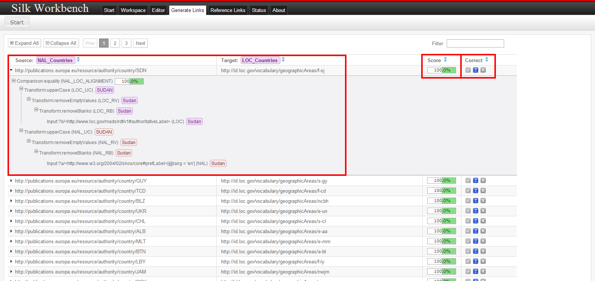

결과물이 우리의 예상을 만족했으므로, 모든 링크를 선택한다.

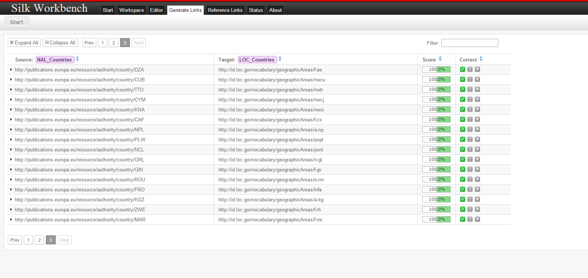

이제, mapping의 결과를 가져올 수 있다.

## 5. SKOS 형식 mapping 결과 가져오기

이제 [SILK Workbench](https://www.assembla.com/spaces/silk/wiki/Silk_Workbench)에서 완성된 mapping의 결과를 저장할 output file을 추가해야 한다. output을 만들기 위해서는 **Workspace** 탭을 클릭한 후 tutorial의 초반에 생성된 프로젝트의 **Output** 버튼을 클릭한다. 

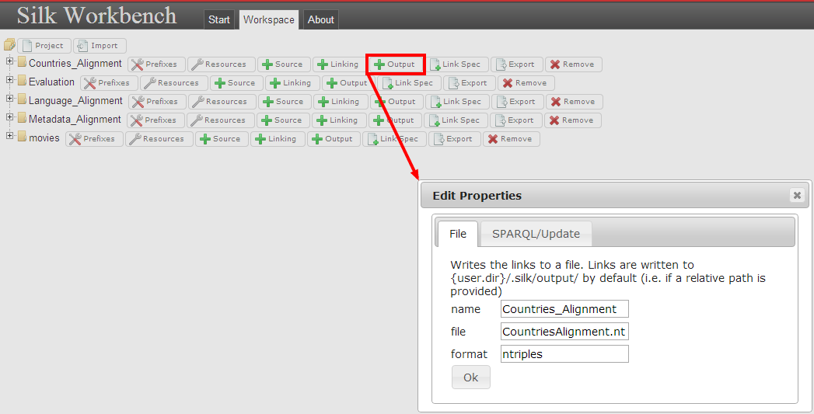

일단 output이 생성되면, **reference links** 탭에 있는 **linking task** 버튼을 누른다. 이 탭에서, 가져오기 함수(export function)는 유저가 N-Triples 형식으로 mapping을 가져오는 것을 가능하게 한다.  방금 만든 **output**을 선택한다.

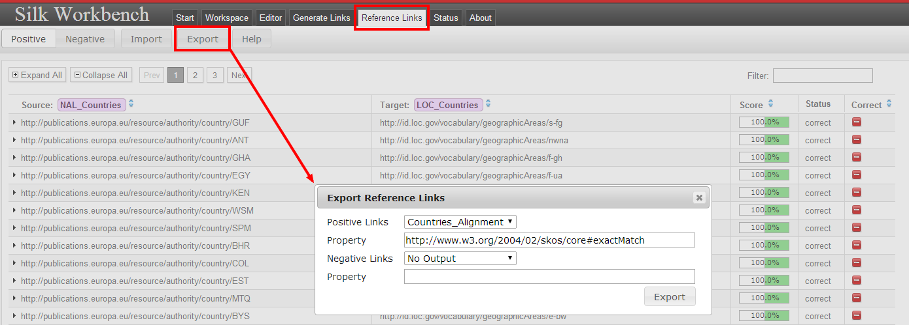

결과적으로, 215개의 record들이 정확하게 서로 연결된 것을 볼 수 있다. 그러므로 이 tutorial에서 설명되지 않는 다음 단계들은 가까운 연결 또는 연결되지 않는 나라들을 확정짓는 작업이 될 것이다.

[Click here to download the N-Triples file](https://joinup.ec.europa.eu/sites/default/files/inline-files/CountriesAlignment.txt)

Nature of documentation: Manual (technical documentation)

> 이 글은 [https://joinup.ec.europa.eu](https://joinup.ec.europa.eu)의  **Tutorial on the use of SILK for aligning controlled vocabularies**을 번역한 글입니다.