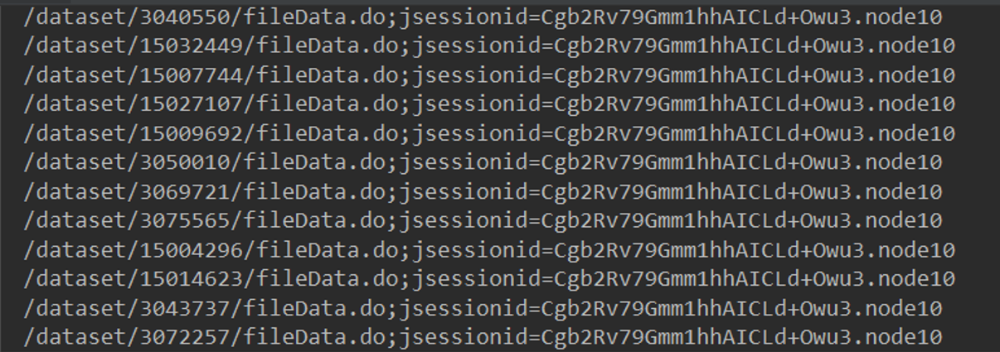

DCAT(Data Catalog Vocabulary)란 웹 상에 분포되어있는 다양한 종류의 데이터베셋에 대한 정형화된 특성 어휘이다. 우리는 이 DCAT와 그와 비슷하지만 다양한 목적을 가진 어휘인 DCAT-AP등의 어휘를 이용해 데이터셋들의 관계를 찾을 수 있다.

나의 목표는 공공 데이터 포털을 비롯한 대한민국의 여러 가지 데이터 포털 사이트들의 데이터셋들의 연관성을 파악하고 이를 이용한 연관 검색 어플리케이션 개발에 있다. 그러기 위한 첫 번째 과정은 데이터 포털 사이트의 데이터셋들이 가지고 있는 메타데이터를 DCAT 어휘와 매핑하는 과정을 우선적으로 진행했다.

## 1. 공공 데이터 포털(data.go.kr) 메타데이터 확인

공공 데이터 포털(이하 datagov)은 총 3종류의 데이터셋 모음을 가지고 있다. 파일데이터, 오픈API, 표준데이터가 그 셋이다. 파일데이터는 dcat:Dataset으로 표현되고 오픈API는 dcat:DataService로 표현될 수 있다. 두 가지 종류 모두를 확인하기에는 시간이 부족하기에 dcat:Dataset인 파일데이터에 한해서 어떠한 메타데이터를 가지고 있는지 확인해 보았다.


위 사진은 datagov에 존재하는 충청남도 공주시 전국대회개최현황에 관한 파일 데이터셋이다. datagov에서는 이 데이터셋을 사용하는 사용자들에게 여러 가지 메타데이터들을 제공하는데, 제공기관, 관리부서명, 관리부서 전화번호 등의 좌측에 존재하는 메타데이터들과 업데이트 주기, 비용부과유무, 다운로드 횟수 등의 가운데에 존재하는 메타데이터들이 이들이다.

메타데이터를 확인했으니 다음으로는 파싱하는 과정을 진행했다.

## 2. 메타데이터 파싱

### 2.1 파일데이터셋 URL 가져오기

우선적으로 진행해야 할 과정을 전체 파일 데이터셋들의 수를 파악해야 하는 것이였다.


데이터셋들의 수는 count class의 span 요소 안의 값이었으므로 이를 찾아 cnt_list라는 리스트에 저장했다.

```python
# check count of data
# fileData is in index 0, openApi is in index 1
cnt_list = ['DATA', 'OPENAPI']
print("Counting number of data")
for i in range(2):
    check_cnt_url = 'https://www.data.go.kr/search/index.do?index=' + cnt_list[i] + \
                    '&query=&currentPage=1&countPerPage=10'
    with urllib.request.urlopen(check_cnt_url) as response:
        html = response.read()
        soup = BeautifulSoup(html, 'html.parser')
    print(cnt_list[i], ': ', sep='', end='')
    cnt_list[i] = int(soup.find('span', {'class': 'count'}).string.replace(',', ''))
    print(cnt_list[i])
```

혹시 나중에 오픈 API에 대한 메타데이터들에 대해서도 작업할 수 있으므로 이에 대한 과정도 진행하였다.

파일데이터셋의 base url은 [https://www.data.go.kr/search/index.do?index=DATA&query=&currentPage=1&countPerPage=10](https://www.data.go.kr/search/index.do?index=DATA&query=&currentPage=1&countPerPage=10)이다. 이 url에서 countPerPage는 말 그대로 페이지 당 표시되는 데이터셋의 수이고 currentPage는 현재 표시되고있는 페이지다. 이를 토대로 각각의 데이터셋들의 url을 가져왔다.


데이터셋의 url은 data-title의 href로 존재했으므로 전체 데이터셋에 대해 모든 url을 파싱해와 pickle파일로 저장하는 작업을 진행했다.

```python
# get url of fileData
# 100 url will be append to list at once
# url_list will be saved to pickle file
print("Getting url of fileData")
url_list = []
for i in range(1, int(cnt_list[0] / 100) + 2):
    to_get_url = 'https://www.data.go.kr/search/index.do?index=DATA&query=&currentPage=' + \
                 str(i) + '&countPerPage=100'
    try:
        with urllib.request.urlopen(to_get_url) as response:
            html = response.read()
            soup = BeautifulSoup(html, 'html.parser')
    except:
        print('ERROR')
        continue
    data_item = soup.find_all('div', {'class': 'data-item'})
    for j in data_item:
        url_list.append(j.find('a')['href'])
    print("Progress: ", (i / ((int(cnt_list[0]) / 100) + 2) * 100), "%", sep='')
with open('url_list.pickle', 'wb') as f:
    pickle.dump(url_list, f, pickle.HIGHEST_PROTOCOL)
```

가져온 리스트들은 다음과 같은 형식으로 총 27,000여개의 데이터셋들의 url들이 저장되어 있었다.



### 2.2 메타데이터 파싱

모든 url들을 가져왔으므로 이제 이를 이용해 메타데이터들을 파싱하는 과정을 진행했다.


좌측 사이드에 존재하는 메타데이터들은 dataset-meta class의 div로 둘러싸여 있었고 meta-items list 안의 두번째 요소로 존재했다. 이 메타데이터들은 BeautifulSoup로 파싱이 가능했지만 가운데에 존재했던 테이블 안의 메타데이터들을 어째선가 파싱이 되지 않았다.


왜 파싱이 되지 않는지 이유를 살펴보니 이 테이블은 데이터셋 안의 데이터셋, 예를 들어, 여러가지 주제를 가진 데이터셋의 데이터들이나, 다른 등록일을 가진 데이터들, 그리고 다른 파일 형식을 가진 데이터들의 메타데이터들을 표현하기 위해 javascript를 이용해 테이블을 불러오는 방식으로 메타데이터를 표현하는 동적 웹페이지 형태로 제공되는 것이었다.


그렇기 때문에 해결책을 찾아보던 와중 동적 웹페이지 파싱을 위한 파이썬 라이브러리인 selenium을 사용해 보았다. 데이터셋은 pandas의 Dataframe 형식으로 저장해 csv파일로 변환했다.

```python
# get metadata from url in url_list
# base url + url_list is the url of the fileData
options = webdriver.ChromeOptions()
options.add_argument('headless')
options.add_argument('window-size=1920x1080')
options.add_argument("disable-gpu")
driver = webdriver.Chrome('./chromedriver', chrome_options=options)
driver.implicitly_wait(3)
with open('url_list.pickle', 'rb') as f:
    url_list = pickle.load(f)
base_url = 'https://www.data.go.kr'

progress = 1
for i in url_list:
    try:
        data_url = base_url + i
        driver.get(data_url)
        html = driver.page_source
        soup = BeautifulSoup(html, 'html.parser')

        # get metadata from class: dataset-meta in html
        dataset_meta = soup.find('div', {'class': 'dataset-meta'})
        meta_items = dataset_meta.find_all('ul', {'class': 'meta-items'})
        meta_items.pop()
        di = {}
        for cnt in meta_items:
            items = cnt.find_all('li')
            di[items[0].string.strip()] = items[1].string.strip()

        dataset_metatable = soup.find('table', {'class': 'table table-bordered detail-table detail-api-table'})
        metatable_th = dataset_metatable.find_all('th')
        metatable_td = dataset_metatable.find_all('td')
        di['이름'] = metatable_th[0].string.strip()
        metatable_th.pop(0)

        for th, td in zip(metatable_th, metatable_td):
            try:
                di[th.string.strip()] = td.string.strip()
            except:
                try:
                    di[th.string.strip()] = td.a.string.strip()
                except:
                    try:
                        di[th.string.strip()] = td.a.find('img')['alt']
                    except:
                        di[th.string.strip()] = ''
                        print('ERORR')

        if '제공기관' not in di:
            di['제공기관'] = ''
        if '관리부서명' not in di:
            di['관리부서명'] = ''
        if '관리부서 전화번호' not in di:
            di['관리부서 전화번호'] = ''
        if '등록일' not in di:
            di['등록일'] = ''
        if '키워드' not in di:
            di['키워드'] = ''
        if '보유근거' not in di:
            di['보유근거'] = ''
        if '수집방법' not in di:
            di['수집방법'] = ''
        if '데이터한계' not in di:
            di['데이터한계'] = ''
        if '이름' not in di:
            di['이름'] = '이름'
        if '비용부과유무' not in di:
            di['비용부과유무'] = '비용부과유무'
        if '수정일' not in di:
            di['수정일'] = '수정일'
        if '업데이트 주기' not in di:
            di['업데이트 주기'] = '업데이트 주기'
        if '다운로드 횟수' not in di:
            di['다운로드 횟수'] = '다운로드 횟수'
        if '이용허락범위' not in di:
            di['이용허락범위'] = '이용허락범위'
        if '제공형태' not in di:
            di['제공형태'] = '제공형태'
        if 'URL' not in di:
            di['URL'] = 'URL'
        if '설명' not in di:
            di['설명'] = '설명'
        if '차기등록예정일' not in di:
            di['차기등록예정일'] = '차기등록예정일'
        if '비용부과기준 및 단위' not in di:
            di['비용부과기준 및 단위'] = '비용부과기준 및 단위'
        if '기타유의사항' not in di:
            di['기타유의사항'] = ''

        df = df.append(pd.DataFrame([[di['제공기관'], di['관리부서명'], di['관리부서 전화번호'], di['등록일'], di['키워드'],
                                      di['보유근거'], di['수집방법'], di['데이터한계'], di['이름'], di['비용부과유무'],
                                      di['수정일'], di['업데이트 주기'], di['다운로드 횟수'], di['이용허락범위'],
                                      di['제공형태'], di['URL'], di['설명'], di['차기등록예정일'], di['비용부과기준 및 단위'],
                                      di['기타유의사항']]],
                                    columns=['제공기관', '관리부서명', '관리부서 전화번호', '등록일', '키워드', '보유근거',
                                             '수집방법', '데이터한계', '이름', '비용부과유무', '수정일', '업데이트 주기',
                                             '다운로드 횟수', '이용허락범위', '제공형태', 'URL', '설명', '차기등록예정일',
                                             '비용부과기준 및 단위', '기타유의사항']), ignore_index=True, sort=True)

        print("Progress: ", progress / cnt_list[0] * 100, sep='')
        progress += 1
    except:
        continue

df.to_csv("test_final.csv", mode='w', encoding="euc-kr")
```

메타데이터의 유형을 딕셔너리의 키로 지정해 딕셔너리에 메타데이터들을 저장한 후 이 딕셔너리를 Dataframe으로 변환했다. 데이터셋마다 가지고 있는 메타데이터의 종류가 다른 경우가 존재했으므로 이에 대한 예외 또한 처리하기 위해 코드의 줄 수가 길어지고 가독성이 떨어졌다.

코드엔 이상이 없었고 프로그램이 정상적으로 종료가 되었지만 예상치 못한 난관에 봉착했다. 속도가 너무 느리다는 점이었다. 100개를 샘플로 실행시켜 본 결과 다음 그림과 같이 모든 메타데이터들이 잘 저장이 되었지만, 대략 3분의 시간이 소요되었다. 27000여개를 저장하기 위해서는 무려 13시간 30분이라는 시간이 예상되는 것이었다. 


작업중인 컴퓨터의 성능이 매우 떨어지는 것도 있지만, 13시간이라는 시간은 너무 비효율적이었기 때문에 다른 방법이 있는지 찾아보기 시작했다.  그 다음의 과정은 2번째 글에 작성한다.