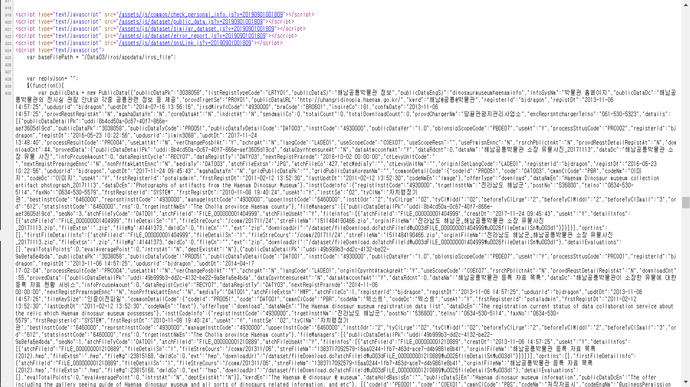
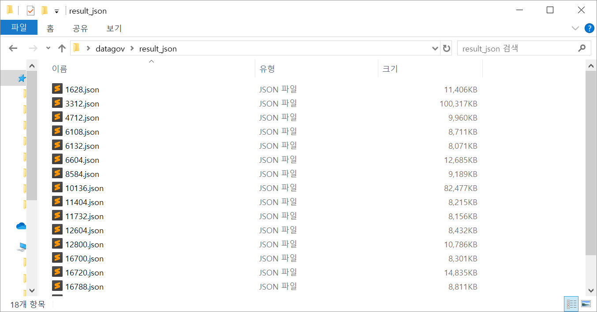

# DCAT를 이용한 데이터셋 연관 어플리케이션(2) - 메타데이터 파싱

지난 글에 이어서 메타데이터를 파싱하는 과정에 대해 작성한다. 지난 글에서 Selenium을 사용해 동적 웹페이지를 파싱하는 과정에서 매우 많은 시간이 소요되었으므로 이를 해결하기 위한 방법을 찾아 보았다.

### 2.3 속도 향상

페이지의 가운데에 존재하는 메타데이터들은 페이지 접속 시 javascript 함수를 통해 db에서 불러오는 형식으로 가져오는 것을 확인할 수 있었다. 페이지에 요청(request)을 보내는 동시 db는 여러 가지 css, js, sql파일들을 가져오고 이를 통해 메타데이터들을 표시해주는 것이었다. 이 중 fileData.do라는 파일의 publicData라는 변수가 페이지에 표시되는 메타데이터와는 다르지만 더욱 방대한 양의 메타데이터들을 가지고 있는 변수라는 것을 알게 되었다. 웹과 네트워크에 대한 지식은 적지만 내가 가져온 url들의 마지막 부분에 fileData.do라는 것이 존재했었다는 것을 알고 페이지의 소스를 한번 보았다.



내 예상은 정확했다. 페이지의 소스 html 밖에는 publicData라는 변수로 데이터셋의 메타데이터들이 표시되어 있었던 것이다. 화면에 표시된 메타데이터보다 방대한 데이터들이 존재했었던 것이다. 메타데이터들은 json형태로 저장되어 있었고 이를 가져오는 과정을 진행했다.

### 2.4 다시 한번 파싱

전에 했던 메타데이터들과는 완전히 다른 종류의 메타데이터들이므로 전의 것들을 잊고 새로운 메타데이터들의 파싱을 진행했다. html 파싱이 아니므로 bs4는 사용하지 않고 request만을 사용했다. publicData의 끝의 패턴을 파악해 split하는 과정으로 publicData만을 가져왔다. 여기서 publicData는 python의 dictionary와 거의 동일한 json파일이므로 dictionary 형태로 번호를 매겨 저장한 후 json파일로 변환했다.

```python
        dicts = {}
        print("Processing")
        base_url = 'https://www.data.go.kr'
        for index, i in enumerate(aaa):
            data_url = base_url + i
            try:
                with urllib.request.urlopen(data_url) as response:
                    html = response.read().decode('utf-8')
                html = html.split('new PublicData(')
                html = html[1].split(', [{"codeId"')
                dic = json.loads(html[0])
                dicts[index] = dic
            except:
                print("Continue_1")
                continue
        print("Start saving")
        try:
            with open("json/result.json", "w", encoding='UTF-8-sig') as json_file:
                json.dump(dicts, json_file, indent=4, ensure_ascii=False)
                json_file.write("\n")
            print("Finish saving")
        except:
            print("Continue_2")
```

이러한 과정을 통해 메타데이터들을 파싱하니 여러가지 데이터들이 눈에 들어왔다. 다음은 파싱한 데이터 중 일부분이다. json형식으로 저장되었다.

```json
"1": {
        "publicDataPk": "15009946",
        "publicDataSj": "경상남도 밀양시_상수도수질검사",
        "infoSysNm": "홈페이지",
        "publicDataDc": "밀양시 상수도 수질검사 안내",
        "provdTrgetSe": "PROV01",
        "publicDataURL": "my.go.kr",
        "kwrd": "상수도@수질@상수도수질",
        "registerId": "kjpark79",
        "registDt": "2015-09-30 10:39:12",
        "updusrId": "dkdlfltm2",
        "updtDt": "2015-10-02 10:05:20",
        "jrsdMiryfcCode": "5360000",
        "brmCode": "BR1502",
        "inqireCo": 40,
        "registTy": "RETY02",
        "deleteAt": "N",
        "confmDate": "2015-10-02 10:05:20",
        "provdReqstRegistAt": "N",
        "mgahaDataYn": "N",
        "coreDataAt": "N",
        "indictAt": "N",
        "sendmailCo": 0,
        "totalCount": 0,
        "totalDownloadCount": 0,
        "provdChargerNm": "-",
        "encReprsntchargerTelno": "055-359-5618",
        "details": [
            {
                "publicDataDetailPk": "uddi:6cf8ec59-7857-4fc5-b075-959d26fca20f",
                "publicDataPk": "15009946",
                "publicDataTyCode": "PR0051",
                "publicDataTyDetailCode": "DAT001",
                "insttCode": "5360000",
                "publicDataVer": "1.0",
                "pblonsipScopeCode": "PBDE07",
                "useAt": "Y",
                "processSttusCode": "PRCO01",
                "registerId": "nadirzenith",
```

이러한 방식으로 파싱을 진행하니 무려 13시간이나 소요될 것을 40~50분 정도로 줄였지만 아직도 만족스럽지 못했다. 더욱 속도를 향상시키기 위해 파이썬에서 기본적으로 제공되는 multiprocessing을 사용해 보았다.

```python
import urllib.request
import urllib.parse
import pickle
import json
import os
import multiprocessing
import sys
size = 20

def good(url):
    proc = os.getpid()
    try:
        dicts = {}
        num = url.pop()
        print("Processing")
        base_url = 'https://www.data.go.kr'
        for index, i in enumerate(aaa):
            data_url = base_url + i
            try:
                with urllib.request.urlopen(data_url) as response:
                    html = response.read().decode('utf-8')
                html = html.split('new PublicData(')
                html = html[1].split(', [{"codeId"')
                dic = json.loads(html[0])
                dicts[index] = dic
            except:
                print("Continue_1")
                continue
        print("Start saving")
        try:
            with open("json/" + str(proc) + ".json", "w", encoding='UTF-8-sig') as json_file:
                json.dump(dicts, json_file, indent=4, ensure_ascii=False)
                json_file.write("\n")
            print("Finish saving")
        except:
            print("Continue_2")
    except:
        print("ERROR"+str(proc))
    sys.exit(1)
    return


if __name__ == '__main__':
    print("Multiprocessing start")
    with open('url_list.pickle', 'rb') as f:
        url_list = pickle.load(f)
    print(len(url_list))
    urllist = []

    for i in range(size):
        urllist.append(url_list[int(i*(len(url_list)/size)):int((i+1)*(len(url_list)/size))])

    print(len(url_list))
    for i in range(size):
        print(len(url_list[i]))
    pool = multiprocessing.Pool(processes=size)
    pool.map(good, urllist)
    pool.close()
    pool.join()
```

url_list를 20등분하여 20개의 프로세서에서 실행시키는 작업을 수행하였다. 파일의 이름을 정하는 과정이 껄끄러웠지만 중복되지 않는 경우의 수는 프로세서의 nickname을 사용하는 것 밖에 없다고 생각하여 proc이라는 변수를 사용해 이름을 지정해 주었다.

multiprocessing을 사용해 20개의 프로세서에서 실행시키니 40~50분이 걸리던 작업이 무려 2~3분으로 단축되었다. 하지만 또 하나의 난관에 봉착했다. 몇 몇개의 프로세서가 작동 중에 중지되는 현상이 일어난 것이었다. 이 현상에 대해 찾아보았지만 해결하지 못했고 20개를 돌려 얻은 18개의 메타데이터들에 대해서만 작업을 진행하였다. 모아진 데이터들은 다음의 그림처럼 랜덤한 프로세서의 nickname의 이름을 가진 json파일로 저장되었다.



그 다음 이 json 파일들을 한 파일로 묶는 작업을 진행하였다.

```python
import json
import os

path = './result_json'
file_list = os.listdir(path)

json_data = []
for i in file_list:
    with open(path + '/' + i, encoding="utf-8-sig") as json_file:
        json_datum = json.load(json_file)
    json_data.append(json_datum)

json_len = 0
for i in json_data:
    json_len += len(i)

dicts = {}
idx = 1
for i in json_data:
    for j in i:
        dicts[idx] = i[j]
        idx += 1

with open("result.json", "w", encoding='UTF-8-sig') as json_file:
    json.dump(dicts, json_file, indent=4, ensure_ascii=False)
    json_file.write("\n")

```

이렇게 메타데이터 파싱은 끝났고 총 모아진 메타데이터 json 파일은 총 24000여개의 데이터셋들의 메타데이터들의 모음이다. 다음 진행할 과정은 이 메타데이터들의 요소들을 dcat 어휘와 매핑하는 과정이다.