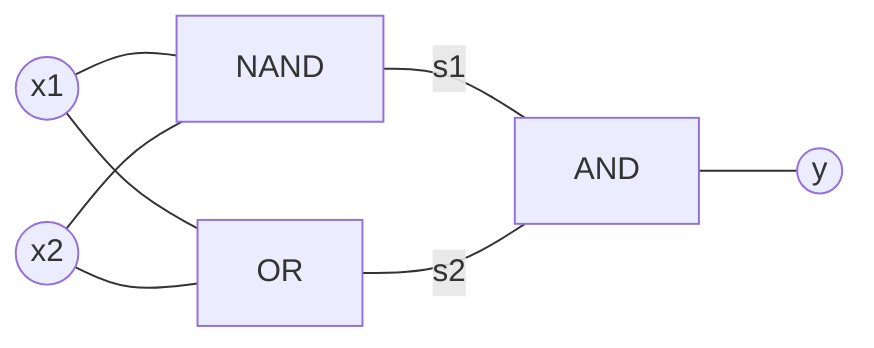
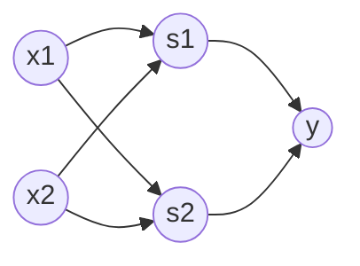

# Chapter 2. 퍼셉트론

## 2.1 퍼셉트론이란

퍼셉트론을 왜 알아야 하는가?

: 신경망의 기원이 되는 알고리즘이기 때문.

퍼셉트론이란?

: 다수의 신호를 입력으로 받아 하나의 신호를 출력, **신호**란 전류나 강물과 같이 **흐름**이라는 이미지를 떠올리면 됨. 퍼셉트론 신호는 흐름을 만들고 정보를 전달


위 그림은 입력으로 2개의 신호를 받은 퍼셉트론. 

x_1, x_2는 입력 신호, y는 출력, w_1, w_2는 가중치. 

그림의 원을 **뉴런** 또는 **노드**라고 부름. 입력 신호가 뉴런에 보내질 때 가중치가 곱해짐.

뉴런에서 보낸 신호의 총합이 정해진 한계. 즉, 임계값(θ)을 넘어설 때만 1을 출력함.

위의 간단한 퍼셉트론을 수식으로 나타내면 다음과 같음:
$$
y = 
\begin{cases}
0 & (w_1x_1 + w_2x_2\le\theta)
\\ 1 & (w_1x_1 + w_2x_2>\theta)
\end{cases}
$$
가중치 w는 신호가 결과에 주는 영향력을 조절하는 요소. 즉, 가중치가 클수록 중효한 신호.

---

## 2.2 단순한 논리 회로

AND 게이트

| x_1  | x_2  | y    |
| ---- | ---- | ---- |
| 0    | 0    | 0    |
| 1    | 0    | 0    |
| 0    | 1    | 0    |
| 1    | 1    | 1    |

AND 게이트를 2.1절의 퍼셉트론으로 표현하고 싶다면, w_1과 w_2와 θ의 값을 어떻게 설정해야 할까?

:무수히 많다. ex) (w_1, w_2, θ) = (0.5, 0.5, 0.7), (0.5, 0.5, 0.8), (1.0, 1.0, 1.0)

NAND 게이트

| x_1  | x_2  | y    |
| ---- | ---- | ---- |
| 0    | 0    | 1    |
| 1    | 0    | 1    |
| 0    | 1    | 1    |
| 1    | 1    | 0    |

OR 게이트

| x_1  | x_2  | y    |
| ---- | ---- | ---- |
| 0    | 0    | 0    |
| 0    | 1    | 1    |
| 1    | 0    | 1    |
| 1    | 1    | 1    |

NAND, OR 게이트 또한 AND 게이트와 같이 퍼셉트론으로 표현 가능함.

---

## 2.3 퍼셉트론 구현하기

다음은 x_1과 x_2를 인수로 받는 AND 게이트를 함수로 구현한 예제임.

```python
def AND(x1, x2):
    w1, w2, theta = 0.5, 0.5, 0.7
    tmp = x1*w1 + x2*w2
    if tmp <= theta:
        return 1
    elif tmp > theta:
        return 1
```

결과:


위의 AND 게이트는 잘 구동될 뿐만 아니라 직관적이고 알기 쉽지만 θ를 -b로 치환하면 다음 식과 같이 됨.
$$
y = 
\begin{cases}
0 & (b+w_1x_1 + w_2x_2\le0)
\\ 1 & (b+w_1x_1 + w_2x_2>0)
\end{cases}
$$
2.1절의 식과 위의 식은 기호 표기만 다르지 의미는 같음.

b를 **편향(bias)**라고 함. 즉, 퍼셉트론은 입력 신호에 가중치를 곱한 값과 편향을 합하여 0 또는 1을 출력함.

다음은 편향을 사용해 구현한 예제임.

```python
import numpy as np
def AND(x1, x2):
    x = np.array([x1, x2])
    w = np.array([0.5], [0.5])
    b = -0.7
    tmp = np.sum(w*x) + b
    if tmp <= 0:
        return 0
    else:
        return 1
```

결과:


NAND와 OR 게이트를 구현한 예제임.

```python
def NAND(x1, x2):
    x = np.array([x1, x2])
    w = np.array([-0.5, -0.5])
    b = 0.7
    tmp = np.sum(w*x) + b
    if tmp <= 0:
        return 0
    else:
    	return 1

def OR(x1, x2):
    x = np.array([x1, x2])
    w = np.array([0.5, 0.5])
    b = -0.2
    tmp = np.sum(w*x) + b
    if tmp <= 0:
        return 0
    else:
        return 1
```

결과:


---

## 2.4 퍼셉트론의 한계

XOR 게이트를 생각해보자.

| x_1  | x_2  | y    |
| ---- | ---- | ---- |
| 0    | 0    | 0    |
| 1    | 0    | 1    |
| 0    | 1    | 1    |
| 1    | 1    | 0    |


위의 그림은 XOR 게이트를 시각화 한 것임. 

이 경우 직선 하나로 나누는 영역을 만들어 낼 수 있을 것인가? -> 선형과 비선형의 개념


곡선이라면 나누는 영역을 만들어 낼 수 있음. 이를 **비선형** 영역, 직선의 영역을 **선형** 영역이라고 함.

---

## 2.5 다층 퍼셉트론

퍼셉트론으로는 XOR 게이트를 표현할 수 없지만 **다층 퍼셉트론(multi-layer perceptron)**으로 XOR 게이트를 표현할 수 있음.



NAND, OR, AND 게이트를 조합해 XOR게이트를 완성할 수 있음.

| x_1  | x_2  | s_1  | s_2  | y    |
| ---- | ---- | ---- | ---- | ---- |
| 0    | 0    | 1    | 0    | 0    |
| 1    | 0    | 1    | 1    | 1    |
| 0    | 1    | 1    | 1    | 1    |
| 1    | 1    | 0    | 1    | 0    |

XOR 게이트를 구현한 예제임.

```python
def XOR(x1, x2):
    s1 = NAND(x1, x2)
    s2 = OR(x1, x2)
    y = AND(s1, s2)
    return y
```

결과:


위의 XOR 게이트를 뉴런을 통한 퍼셉트론으로 시각화하면 다음과 같음.



이렇게 층이 여러 개인 퍼셉트론을 다층 퍼셉트론이라 함. 신호 전달 과정은 다음과 같음.

1. 0층의 두 뉴런이 입력 신호를 받아 1층의 뉴런으로 신호를 보냄
2. 1층의 뉴런이 2층의 뉴런으로 신호를 보내고, 2층의 뉴런이 출력 신호 y를 내보냄

---

## 2.6 NAND에서 컴퓨터까지

다층 퍼셉트론은 복잡한 회로를 만들 수 있음. ex)가산기, 인코더, 패리티 검사 회로, 컴퓨터(?)

컴퓨터 내부에서 이뤄지는 처리는 사실 NAND 게이트의 조합임. but, 이론상 가능...