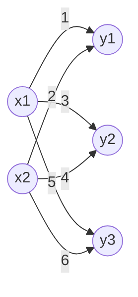
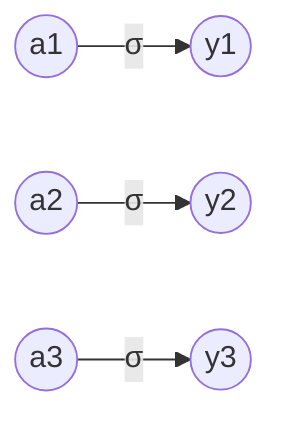
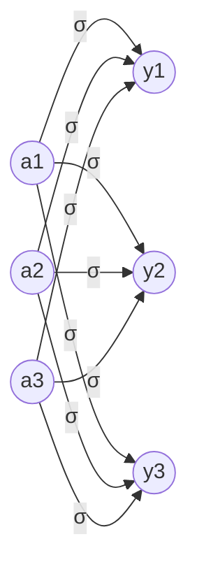

# Chapter 3. 신경망

퍼셉트론은 가중치 설정을 사람이 수동으로 해줘야 한다는 단점을 가지고 있음.

-> 이를 자동으로 학습하는 능력을 가진 신경망이 나타남

## 3.1 퍼셉트론에서 신경망으로

신경망을 그림으로 나타내면 다음과 같음.


가장 왼쪽 줄은 **입력층(Input layer)**, 맨 오른쪽 줄은 **출력층(Output layer)**, 중간 줄은 **은닉층(Hidden layer)**.

퍼셉트론과 다를게 없어 보이지만 신호를 전달하는 방식이 다름.

---

## 3.2 활성화 함수(activation function)

입력 신호의 총합을 출력 신호로 변환하는 함수: 입력 신호의 총합이 활성화를 일으키는지를 정함.

2절의 퍼셉트론의 수식을 다시 써보면 다음과 같음.
$$
y = 
\begin{cases}
0 & (b + w_1x_1 + w_2x_2 \le 0)
\\1 & (b + w_1x_1 + w_2x_2 > 0)
\end{cases}
$$
이 식을 하나의 활성 함수 h(x)로 표현하면,
$$
y = h(b +w_1x_1 + w_2x_2)
\\
h(x) = 
\begin{cases}
0 & (x\le0)
\\1 & (x > 0)
\end{cases}
$$
위의 식은 가중치가 곱해진 입력 신호의 총합을 계산하고, 그 합을 활성화 함수에 입력해 결과를 내는 2단계로 처리됨. 
$$
a = b +w_1x_1 + w_2x_2
\\y = h(a)
$$
위와 같은 활성화 함수는 임계값을 경계로 출력이 바뀜 -> 이와 같은 함수를 **계단 함수(step function)**이라 함.

### 시그모이드 함수(sigmoid function)

$$
h(x) = \frac{1}{1 + exp(-x)}
$$

신경망에서는 활성화 함수로 시그모이드 함수를 이용해 신호를 변환하고, 변환된 신호를 다음 뉴런에 전달함.

퍼셉트론과 신경망의 주된 차이는 활성화 함수뿐임. 그 외의 계층적 구조와 신호 전달 방법은 같음.

### 계단 함수(step function)

파이썬으로 구현한 계단 함수:

```python
def step_function(x):
    if x > 0:
        return 1
    else:
        return 0
```

위 구현은 단순하고 쉽지만, 파라미터 x는 실수만 받아들임. -> numpy 배열을 파라미터로 받을 수 없음.

해결 방안:

```python
def step_function(x):
    y = x > 0
    return y.astype(np.int)
```

이는 매우 엉성해 보이지만 numpy의 편리한 트릭을 사용한 덕분임. 자세한 내용은 다음 예제를 보면 알 수 있음.


numpy 배열에 부등호 연산을 수행하면 배열 원소 각각에 부등호 연산을 수행한 bool 배열 생성됨. 그러므로 bool type에서 int type으로 변환하는 과정이 필요함.


방금 전에 정의한 계단 함수를 matplotlib을 사용해 그래프로 그리는 예제:

```python
import numpy as np
import matplotlib.pylab as plt

def step_function(x):
    return np.array(x > 0, dtype=np.int)

x = np.arange(-5.0, 5.0, 0.1)
y = step_function(x)
plt.plot(x, y)
plt.ylim(-0.1, 1.1)
plt.show()
```

np.arange(-5.0, 5.0, 0.1)은 -5.0에서 5.0 전까지 0.1 간격의 numpy 배열을 생성하는 함수. step_function을 통해 나온 결과는 다음과 같음.


파이썬으로 구현한 시그모이드 함수:

```python
def sigmoid(x):
    return 1 / (1 + np.exp(-x))
```

시그모이드 함수 test:

```python
x = np.array([-1.0, 1.0, 2.0])
print(sigmoid(x))
```

결과:


방금 전에 정의한 시그모이드 함수를 그래프로 그리는 예제:

```python
x = np.arange(-5.0, 5.0, 0.1)
y = sigmoid(x)
plt.plot(x, y)
plt.ylim(-0.1, 1.1)
plt.show()
```


다음 그림은 계단 함수와 시그모이드 함수를 비교한 그림임.


가장 먼저 느껴지는 점은 '매끄러움'의 차이. 시그모이드는 부드러운 곡선이지만 계단 함수는 직선임. 또한 시그모이드는 연속적인 실수를 흐르게 할 수 있음. 또한 두 함수 모두 **비선형 함수**임.

하지만, 두 함수 모두 입력이 작을 때의 출력은 0에 가깝고 입력이 커지면 출력이 1에 가까워지는 구조임.

### ReLu 함수(Rectified Linear Unit function)

시그모이드 함수는 오래전부터 이용해왔고, 최근에는 ReLu를 주로 이용함.

입력이 0을 넘으면 그 입력을 그대로 출력하고, 0 이하이면 0을 출력하는 함수임. 그래프는 다음과 같음.


수식으로 표현하면 다음과 같음.
$$
h(x) = 
\begin{cases}
x & (x > 0)
\\0 & (x \le 0)
\end{cases}
$$
python으로 간단하게 구현 가능.

```python
def relu(x):
    return np.maximum(0, x)
```

numpy의 maximum 함수는 두 파라미터 입력 중 큰 값을 반환하는 함수.

---

## 3.3 다차원 배열의 계산

다차원 배열도 그 기본은 '숫자의 집합'. 지금까지 보아온 1차원 배열은 다음과 같음.


배열의 차원 수는 np.ndim()함수로 확인 가능. 배열의 형상은 인스턴스 변수인 shape로 확인 가능.

2차원 배열은 다음과 같음.


행렬의 내적을 구하는 방법은 다음과 같음.


A와 B는 2 * 2 행렬이며, numpy 함수 np.dot()으로 내적을 구할 수 있음.

numpy 행렬을 사용해 신경망을 구현한 예제는 다음과 같음. 이 신경망은 편향과 활성함수를 생략하고 가중치만 가짐.




---

## 3.4 3층 신경망 구현하기


위는 3층 신경망을 시각화한 것임. 1은 편향을 뜻하는 유런임. 굵게 칠해진 부분을 살펴보면:

$a_1^{(1)}$을 가중치를 곱한 신호 두 개와 편향을 합해 다음과 같은 수식으로 나타낼 수 있음.
$$
a_1^{(1)} = w_{11}^{(1)}x_1+w_{12}^{(1)}x_2+b_1^{(1)}
$$
행렬의 내적을 이용하면 1층의 '가중치 부분'을 다음 식과 같이 간소화할 수 있음.
$$
A^{(1)}=XW^{(1)}+B^{(1)}
$$
이때 행렬 $A^{(1)}, X, B^{(1)}, W^{(1)}$은 각각 다음과 같음.
$$
A^{(1)}=(a_1^{(1)} \ a_2^{(1)} \ a_3^{(1)}), \ X=(x_1 \ x_2), \ B^{(1)} = (b_1^{(1)} \ b_2^{(1)} \ b_3^{(1)})
\\
W^{(1)} = 
\begin{pmatrix}
w_{11}^{(1)} \ w_{21}^{(1)} \ w_{31}^{(1)}
\\
w_{12}^{(1)} \ w_{22}^{(1)} \ w_{32}^{(1)}
\end{pmatrix}
$$
파이썬으로 구현하면 다음과 같음:

```python
X = np.array([1.0, 0.5])
W1 = np.array([[0.1, 0.3, 0.5], [0.2, 0.4, 0.6]])
B1 = np.array([0.1, 0.2, 0.3])

print(W1.shape)  # (2, 3)
print(X.shape)   # (2,)
print(B1.shape)  # (3,)

A1 = np.dot(X, W1) + B1
```

1층의 활성화 함수에서의 처리를 그림으로 나타내면 다음과 같음:


은닉층에서의 가중치 합을 a로 표기하고 활성화 함수 h()로 변환된 신호를 z로 표기. 이를 파이썬으로 구현하면 다음과 같음:

```python
Z1 = sigmoid(A1)

print(A1)  # [0.3, 0.7, 1.1]
print(Z1)  # [0.57444252, 0.66818777, 0.75026011]
```

1층에서 2층으로 가는 과정과 그 구현은 다음과 같음:


```python
W2 = np.array([[0.1, 0.4], [0.2, 0.5], [0.3, 0.6]])
B2 = np.array([0.1, 0.2])

print(Z1.shape)  # (3,)
print(W2.shape)  # (3, 2)
print(B2.shape)  # (2,)

A2 = np.dot(Z1, W2) + B2
Z2 = sigmoid(A2)
```

2층에서 출력층으로의 신호 전달 과정과 그 구현은 다음과 같음:


```python
def identity_function(x):
    return x

W3 = np.array([[0.1, 0.3], [0.2, 0.4]])
B3 = np.array([0.1, 0.2])

A3 = np.dot(Z2, W3) + B3
Y = identity_function(A3) # 혹은 Y = A3
```

항등 함수인 identity_function()을 정의한 이유는 입력층에서 2층까지의 신호 전달 과정의 흐름과 통일하기 위해 구현한 것임.

지금까지의 구현을 정리하면 다음과 같음:

```python
def init_network():
    network = {}
    network['W1'] = np.array([[0.1, 0.3, 0.5], [0.2, 0.4, 0.6]])
    network['b1'] = np.array([0.1, 0.2, 0.3])
    network['W2'] = np.array([[0.1, 0.4], [0.2, 0.5], [0.3, 0.6]])
    network['b2'] = np.array([0.1, 0.2])
    network['W3'] = np.array([[0.1, 0.3], [0.2, 0.4]])
    network['b3'] = np.array([0.1, 0.2])
    
    return network

def forward(network, x):
    W1, W2, W3 = network['W1'], network['W2'], network['W3']
    b1, b2, b3 = network['b1'], network['b2'], network['b3']
    
    a1 = np.dot(x, W1) + b1
    z1 = sigmoid(a1)
    a2 = np.dot(z1, W2) + b2
    z2 = sigmoid(a2)
    a3 = np.dot(z2, W3) + b3
    y = identity_function(a3)
    
    return y

network = init_network()
x = np.array([1.0, 0.5])
y = forward(network, x)
print(y)  # [0.31682708 0.69627909]
```

init_network() 함수는 가중치와 편향을 초기화하고 이들을 network에 저장, forward() 함수는 입력 신호를 출력으로 변환하는 처리 과정을 수행. forward는 신호가 순방향으로 전달됨을 알리기 위함임.

---

## 3.5 출력층 설계하기

신경망은 **분류(classfication)**와 **회귀(regression)** 모두에 이용할 수 있지만 다루고자 하는 **문제**에 따라 출력층에서 사용하는 **활성화 함수**가 달라짐. 일반적으로 회귀에는 항등 함수를, 분류에는 소프트맥스 함수를 사용함.

### 항등 함수(identity function)

**항등 함수(identity function)**은 입력을 그대로 출력. 다음 그림과 같음.



### 소프트맥스 함수(softmax function)


$$
y_k = \frac {exp(a_k)} {\sum_{i=1}^{n}exp(a_i)}
$$
$exp(x)$는 $e^x$를 뜻하는 지수 함수, n은 출력층의 뉴런 수, $y_k$는 그중 k번째 출력을 뜻함. 그림으로 나타내면 다음과 같음.



파이썬을 사용한 구현은 다음과 같음.

```python
def softmax(a):
    exp_a = np.exp(a)
    sum_exp_a = np.sum(exp_a)
    y = exp_a / sum_exp_a
    
    return y
```

이 구현은 소프트맥스 함수를 제대로 표현하고 있지만, 오버플로 문제가 발생할 수 있음(지수 함수의 사용 때문). 다음은 소프트맥스 함수를 개선하기 위한 새로운 수식임.
$$
y_k=\frac{exp(a_k)}{\sum_{i=1}^{n}exp(a_i)}=\frac{Cexp(a_k)}{C\sum_{i=1}^{n}exp(a_i)}
\\=\frac{exp(a_k+logC)}{\sum_{i=1}^{n}exp(a_i+logC)}
\\=\frac{exp(a_k+C^{'})}{\sum_{i=1}^{n}exp(a_i+C^{'})}
$$
위의 식이 말하는 것은 소프트맥스의 지수 함수를 계산할 때 어떤 정수를 더해도 결과는 바뀌지 않는다는 것임. 위의 수식을 바탕으로 소프트맥스 함수를 다시 구현하면 다음과 같음.

```python
def softmax(a):
    c = np.max(a)
    exp_a = np.exp(a - c)
    sum_exp_a = np.sum(exp_a)
    y = exp_a / sum_exp_a
    
    return y
```

softmax() 함수를 사용하면 신경망의 출력은 다음과 같이 계산할 수 있음.


위 결과와 같이 소프트맥스 함수의 출력은 0과 1사이의 실수이고 출력의 총합은 1임. 그러므로 소프트맥스 함수의 출력을 **확률**로 해석할 수 있음.

출력층의 뉴런 수는 풀려는 문제에 맞게 적절히 정해야 함. 예를 들어 입력 이미지를 숫자 0부터 9 중 하나로 분류하는 문제라면 출력층의 뉴런을 10개로 설정해야 함.

---

## 3.6 손글씨 숫자 인식

학습 과정은 생략하고, 추론 과정만 구현함. 이 추론 과정을 신경망의 순전파(forward propagation)라고도 함.

MNIST 데이터를 가져오는 파이썬 코드:

```python
import sys, os
sys.path.append(os.pardir)
from dataset.mnist import load_mnist

(x_train, t_train), (x_test, t_test) = load_mnist(flatten=True, normalize=False)

print(x_train.shape)  # (60000, 784)
print(t_train.shape)  # (60000,)
print(x_test.shape)   # (10000, 784)
print(t_test.shape)   # (10000,)
```

MNIST 이미지를 화면으로 불러오는 파이썬 코드:

```python
import sys, os
sys.path.append(os.pardir)
import numpy as np
from dataset.mnist import load_mnist
from PIL import Image

def img_show(img):
    pil_img = Image.fromarray(np.uint8(img))
    pil_img.show()
    
(x_train, t_train), (x_test, t_test) = load_mnist(flatten=True, normalize=False)

img = x_train[0]
label = t_train[0]
print(label)  # 5

print(img.shape)  #(784,)
img = img.reshape(28, 28)
print(img.shape)  #(28, 28)

img_show(img)
```

결과는 다음과 같음:


MNIST 데이터셋을 가지고 추론을 수행하는 신경망을 구현해야 함. 이 신경망은 입력층 뉴런을 784개, 출력층 뉴런을 10개로 구성함. 은닉층은 총 두개로, 첫 번째 은닉층에는 50개의 뉴런을, 두 번째 은닉층에는 100개의 뉴런을 배치함. 이 작업을 처리해줄 세 함수는 다음과 같이 구현함.

```python
def get_data():
    (x_train, t_train), (x_test, t_test) = load_mnist(normalize=True, flatten=True, one_hot_label=False)
    return x_test, t_test

def init_network():
    with open("sample_weight.pkl", "rb") as f:
        network = pickle.load(f)
    
    return network

def predict(network, x):
    W1, W2, W3 = network['W1'], network['W2'], network['W3']
    b1, b2, b3 = network['b1'], network['b2'], network['b3']
    
    a1= np.dot(x, W1) + b1
    z1 = sigmoid(a1)
    a2 = np.dot(z1, W2) + b2
    z2 = sigmoid(a2)
    a3 = np.dot(a2, W3) + b3
    y = softmax(a3)
    
    return y
```

이 함수들을 사용해 **정확도(accuracy)**를 평가해보는 예제:

```python
x, t = get_data()
network = init_network()

accuracy_cnt = 0
for i in range(len(x)):
    y = predict(network, x[i])
    p = np.argmax(y)
    if p == t[i]:
        accuracy_cnt += 1

print("Accuracy: " + str(float(accuracy_cnt) / len(x)))
```

결과:


load_mnist 함수의 인수인 normalize를 True로 설정하면 0~255 범위인 각 픽셀의 값을 0.0~1.0 범위로 변환함. 이와 같이 데이터를 특정 범위로 변환하는 처리를 **정규화(normalization)**라 하고, 신경망의 입력 데이터에 특정 변환을 가하는 것을 **전처리(pre-processing)**라고 함.

### 배치(batch)

MNIST 데이터 한 장의 사진을 입력했을 때의 처리 흐름:

784 -> 784\*50 -> 50\*100 -> 100\*10 -> 10

여러 장을 한꺼번에 입력하는 경우(100장을 묶어 입력했을 때의 처리 흐름):

100\*784 -> 784\*50 -> 50\*100 -> 100\*10 -> 100\*10

이처럼 하나로 묶은 입력 데이터를 **배치(batch)**라고 함. 배치를 사용하면 이미지 1장당 처리 시간을 대폭 줄여줄 수 있음.

