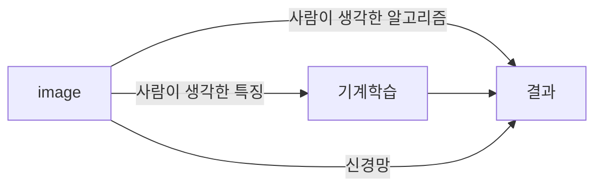

# Chapter 4. 신경망 학습

신경망 학습에서 **학습**이란 훈련 데이터로부터 가중치 매개변수의 최적값을 자동으로 획득하는 것. 이를 가능케 해주는 **지표**인 손실 함수가 있음. 이 손실 함수의 결괏값을 가장 작게 만드는 가중치 매개변수를 찾는 것이 목표.

---

## 4.1 데이터에서의 학습

신경망의 특징은 데이터를 보고 학습할 수 있다는 점. 그러므로 기계학습은 데이터가 생명임. 어떠한 문제를 해결하려고 할 때, 사람의 방법과 기계의 방법은 다름.

사람은 경험과 직관을 단서로 시행착오를 거듭하며 일을 진행하지만, 기계학습에서는 사람의 개입을 최소화하고 수집한 데이터로부터 패턴을 찾으려 시도함.

이미지를 인식하는 것을 예로 들면, 기계 학습이 문제를 해결하는 방법의 하나로, 이미지에서 **특징(feature)**을 추출하고 그 특징의 패턴을 기계학습 기술로 학습하는 방법이 있음. 여기서의 특징은 입력 데이터에서 본질적인 데이터를 정확하게 추출할 수 있도록 설계된 변환기를 가리킴. 이와 같은 기계학습에서는 모아진 데이터로부터 규칙을 찾아내는 역할을 '기계'가 담당함. 기계 학습의 접근법은 다음 그림과 같다.

