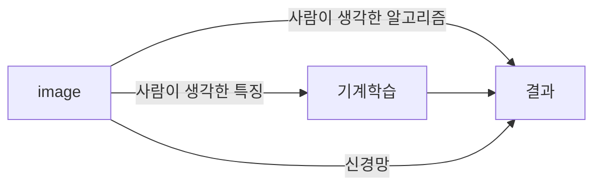

# Chapter 4. 신경망 학습

신경망 학습에서 **학습**이란 훈련 데이터로부터 가중치 매개변수의 최적값을 자동으로 획득하는 것. 이를 가능케 해주는 **지표**인 손실 함수가 있음. 이 손실 함수의 결괏값을 가장 작게 만드는 가중치 매개변수를 찾는 것이 목표.

---

## 4.1 데이터에서의 학습

신경망의 특징은 데이터를 보고 학습할 수 있다는 점. 그러므로 기계학습은 데이터가 생명임. 어떠한 문제를 해결하려고 할 때, 사람의 방법과 기계의 방법은 다름.

사람은 경험과 직관을 단서로 시행착오를 거듭하며 일을 진행하지만, 기계학습에서는 사람의 개입을 최소화하고 수집한 데이터로부터 패턴을 찾으려 시도함.

이미지를 인식하는 것을 예로 들면, 기계 학습이 문제를 해결하는 방법의 하나로, 이미지에서 **특징(feature)**을 추출하고 그 특징의 패턴을 기계학습 기술로 학습하는 방법이 있음. 여기서의 특징은 입력 데이터에서 본질적인 데이터를 정확하게 추출할 수 있도록 설계된 변환기를 가리킴. 이와 같은 기계학습에서는 모아진 데이터로부터 규칙을 찾아내는 역할을 '기계'가 담당함. 기계 학습의 접근법은 다음 그림과 같다.



신경망의 이점은 모든 문제를 같은 맥락에서 풀 수 있다는 점. 세부사항과 관계없이 신경망은 주어진 데이터를 온전히 학습하고, 주어진 문제의 패턴을 발견하려 시도함. 즉 모든 문제를 주어진 데이터 그대로를 입력 데이터로 활용해 'end-to-end'로 학습할 수 있음.

기계학습 문제는 데이터를 **훈련 데이터(training data)**와 **시험 데이터(test data)**로 나눠 학습과 실험을 수행하는 것이 일반적임.

- 훈련 데이터만 사용하여 학습하면서 최적의 매개변수 찾기
- 시험 데이터를 사용하여 앞서 훈련한 모델의 실력을 평가

WHY? 우리가 원하는 것은 범용적으로 사용할 수 있는 모델이기 때문. 

**범용 능력**은 아직 보지 못한 데이터로도 문제를 올바르게 풀어내는 능력. 이 범용 능력을 획득하는 것이 기계학습의 최종 목표.

---

## 4.2 손실 함수

신경망은 '하나의 지표'를 기준으로 최적의 매개변수 값을 탐색하는데, 이 지표를 **손실 함수(loss function)**라고 함. 이 손실 함수는 임의의 함수를 사용할 수도 있지만 일반적으로는 평균 제곱 오차와 교차 엔트로피 오차를 사용함.

### 평균 제곱 오차(mean squared error)

가장 많이 쓰이는 손실 함수는 **평균 제곱 오차(mean squared error)**임. 수식으로는 다음과 같음:
$$
E = \frac{1}{2}\sum_{k}(y_k-t_k)^2
$$
여기서 $y_k$는 신경망의 출력, $t_k$는 정답 레이블, $k$는 데이터의 차원 수를 나타냄.

ex) 손글씨 숫자 인식에서 $y_k$, $t_k$

```
>>> y = [0.1, 0.05, 0.6, 0.0, 0.05, 0.1, 0.0, 0.1, 0.0, 0.0]
>>> t = [0, 0, 1, 0, 0, 0, 0, 0, 0, 0]
```

위의 t와 같이 한 원소만 1로 하고 그 외는 0으로 나타내는 표기법을 **원-핫 인코딩**이라고 함.

파이썬으로 구현한 평균 제곱 오차:

```python
def mean_squared_error(y, t):
    return 0.5 + np.sum((y-t)**2)
```

평균 제곱 오차를 사용한 예제:


평균 제곱 오차를 기준으로는 첫 번째 추정 결과가 정답에 더 가까울 것으로 판단할 수 있음(손실 함수의 결괏값이 더 작으므로).

### 교차 엔트로피 오차(cross entropy error, CEE)

**교차 엔트로피 오차(cross entropy error)**의 수식은 다음과 같음:
$$
E = -\sum_{k}t_klogy_k
$$
여기서의 $log$는 밑이 $e$인 자연로그($log_e$)임. $y_k$는 신경망의 출력, $t_k$는 정답 레이블이며, $t_k$는 정답에 해당하는 인덱스의 원소만 1이고 나머지는 0임(원-핫 인코딩). 그러므로 실질적으로 위의 식은 정답일 때의 추청($t_k$가 1일 때의 $y_k$)의 자연로그를 계산하는 식이 됨. 즉, 교차 엔트로피 오차는 정답일 때의 출력이 전체 값을 정하게 됨.

다음은 자연로그의 그래프임:


x가 1일 때 y는 0이 되고 x가 0에 가까워질수록 y의 값은 점점 작아짐. 교차 엔트로피 오차의 식도 마찬가지로 정답에 해당하는 출력이 커질수록 0에 다가가다가, 그 출력이 1일 때 0이 됨.

파이썬으로 구현한 교차 엔트로피 오차:

```python
def cross_entropy_error(y, t):
    delta = 1e-7
    return -np.sum(t * np.log(y + delta))
```

np.log를 계산할 때 delta를 더해준 이유는 np.log() 함수에 0을 입력하면 -inf가 되어 더 이상 계산을 진행할 수 없기 때문에 아주 작은 값인 $1.0*10^{-7}$을 더해서 절대 0이 되지 않도록 한 것임.

교차 엔트로피 오차를 사용한 예제:


결과(오차 값)가 더 작은 첫 번째 추정이 정답일 가능성이 높다고 판단한 것임.

 ### 미니배치 학습

기계학습 문제는 훈련 데이터를 사용해 학습함. 즉, 훈련 데이터에 대한 손실 함수의 값을 구하고, 그 값을 최대한 줄여주는 매개변수를 찾아냄. 이를 위해서는 모든 훈련 데이터를 대상으로 손실 함수 값을 구해야 함. 예를 들어 교차 엔트로피 오차는 다음의 수식을 따름.
$$
E = -\frac{1}{N}\sum_{n}\sum_{k}t_{nk}logy_{nk}
$$
이때 데이터가 N개라면 $t_{nk}$는 n번째 데이터의 k번째 값을 의미함. 데이터 하나에 대한 손실 함수를 단순히 N개의 데이터로 확장했을 뿐이지만, 마지막에 N으로 나누어 정규화하고 있음.  즉, N으로 나눔으로써 '평균 손실 함수'를 구하는 것임. 이렇게 해서 평균을 구해 사용하면 훈련 데이터 개수와 관계없이 언제는 통일된 지표를 얻을 수 있음.

하지만 빅데이터 수준의 데이터를 대상으로 일일이 손실 함수를 계산하는 것은 현실적이지 않음. 이런 경우 데이터 일부를 추려 전체의 '근사치'로 이용함. 이 일부를 **미니배치(mini-batch)**라고 함. 예를 들어, 60,000장의 훈련 데이터 중에서 100장을 무작위로 뽑아 그 100장만을 사용하여 학습하는 것임. 이러한 학습 방법을 **미니배치 학습**이라고 함.

미니배치 학습을 파이썬으로 구현하는 과정:

MNIST 데이터셋을 읽어오는 코드:

```python
import sys, os
sys.path.append(os.pardir)
import numpy as np
from dataset.mnist import load_mnist

(x_train, t_train), (x_test, t_test) = load_mnist(normalize=True, one_hot_label=True)

print(x_train.shape)
print(t_train.shape)
```

결과:


훈련 데이터에서 무작위로 10장만 빼내는 코드:

```python
train_size = x_train.shape[0]
batch_size = 10
batch_mask = np.random.choice(train_size, batch_size)
x_batch = x_train[batch_mask]
t_batch = t_train[batch_mask]
```

np.random.choice()는 다음 예와 같이 지정한 범위의 수 중에서 무작위로 원하는 개수만큼 꺼낼 수 있음. 


그럼 미니배치같은 배치 데이터를 지원하는 교차 엔트로피 오차는 어떻게 구현할까?

파이썬으로 구현한 (미니배치용) 교차 엔트로피:

```python
def cross_entropy_error_one_hot_encoding(y, t):
    if y.ndim == 1:
        t = t.reshape(1, t.size)
        y = y.reshape(1, y.size)

    batch_size = y.shape[0]
    return -np.sum(t * np.log(y)) / batch_size
```

y는 신경망의 출력, t는 정답 레이블임. 정답 레이블이 원-핫 인코딩이 아닌 숫자 레이블로 주어졌을 때의 교차 엔트로피는 다음과 같이 구현 가능함.

```python
def cross_entropy_error_numeric(y, t):
    if y.ndim == 1:
        t = t.reshape(1, t.size)
        y = y.reshape(1, y.size)

    batch_size = y.shape[0]
    return -np.sum(np.log(y[np.arange(batch_size), t])) / batch_size
```

---

왜 손실 함수를 설정할까?

우리의 궁극적인 목표는 높은 정확도를 끌어내는 매개변수 값을 찾는 것임. 그렇다면 정확도라는 지표를 놔두고 손실 함수의 값이라는 우회적인 방법을 택하는 이유가 무엇일까? -> **'미분'**의 역할에 주목하면 해결됨.

신경망 학습에서는 최적의 매개변수(weight, bias)를 탐색할 때, 손실 함수의 값을 가능한 작게 하는 매개변수 값을 찾음. 이때 매개변수의 미분을 계산하고, 그 미분 값을 단서로 매개변수의 값을 서서히 갱신하는 과정을 반복함.

> 즉, 신경망을 학습할 때 정확도를 지표로 삼아서는 안 되는 이유는 매개변수의 미분이 대부분의 장소에서 0이 되기 때문이다.

그렇다면 정확도를 지표로 삼으면 매개변수의 미분이 대부분의 장소에서 0이 되는 이유는 무엇일까?

정확도는 매개변수의 미소한 변화에는 거의 반응을 보이지 않고, 반응이 있더라고 그 값이 불연속적으로 값자기 변화함. 이는 '계단 함수'를 활성화 함수로 사용하지 않는 이유와 일맥상통함. 계단 함수는 한순간만 변화를 일으키지만, 시그모이드 함수의 미분은 출력이 연속적으로 변하고 곡선의 기울기도 연속적으로 변함. 이는 신경망 학습에서 중요한 성질로, 기울기가 0이 되지 않는 덕분에 신경망이 올바르게 학습할 수 있는 것임.

## 4.3 수치 미분(numerical differentitation)

경사법에서는 기울기(경사) 값을 기준으로 나아갈 방향을 정함.

### 미분

미분은 한순간의 변화량을 표시한 것, 수식으로는 다음과 같음.
$$
\frac{df(x)}{dx}=\lim_{h\to0}\frac{f(x+h)-f(x)}{h}
$$
파이썬으로 구현한 미분:

```python
# 나쁜 구현 예
def numerical_diff(f, x):
    h = 10e-50
    return (f(x + h) - f(x)) / h
```

함수의 이름은 **수치 미분(numerical differentiation)**에서 따온 numerical_diff(f, x)로 함. 얼핏 보면 문제가 없어 보이지만 개선해야 할 점이 2개 있음.

- 반올림 오차 문제

  : 반올림 오차는 작은 값이 생략되어 최종 계산 결과에 오차가 생기게 함. 파이썬에서의 반올림 오차로는 다음과 같은 예가 있음.

  ```
  >>> np.float32(1e-50)
  0.0
  ```

  이와 같이 1e-50을 float32형으로 나타내면 0.0이 되어 올바로 표현할 수 없음.

- 함수 f의 차분(임의 두 점에서의 함수 값들의 차이)과 관련된 문제

  앞의 구현에서는 x + h와 x 사이의 함수 f의 차분을 계산하고 있지만, 애당초 이 계산에는 오차가 있음. 

  이 오차를 줄이기 위해 (x + h)와 (x - h)일 때의 함수 f의 차분을 계산하는 방법을 쓰기도 함. 이 차분은 x를 중심으로 그 전후의 차분을 계산한다는 의미에서 **중심 차분** 혹은 **중앙 차분**이라고 함.

이상의 두 개선점을 적용해 가시 구현한 수치 미분:

```python
def numerical_diff(f, x):
    h = 1e-4
    return (f(x + h) - f(x - h)) / (2*h)
```

위의 수치 미분을 사용해 간단한 함수를 미분해보자. 다음과 같은 2차함수이다.
$$
y = 0.01x^2 +0.1x
$$
이 식을 파이썬으로 구현하면 다음과 같다.

```python
def function_1(x):
    return 0.01*x**2 + 0.1*x
```

이 함수를 그리면 다음과 같다.

```python
import numpy as np
import matplotlib.pylab as plt

x = np.arange(0.0, 20.0, 0.1)
y = function_1(x)
plt.xlabel("x")
plt.ylabel("f(x)")
plt.plot(x, y)
plt.show()
```


x=5일 때와 10일 때의 이 함수의 미분:


이렇게 계산한 미분 값이 x에 대한 f(x)의 변화량 즉, 함수의 기울기에 해당함. 